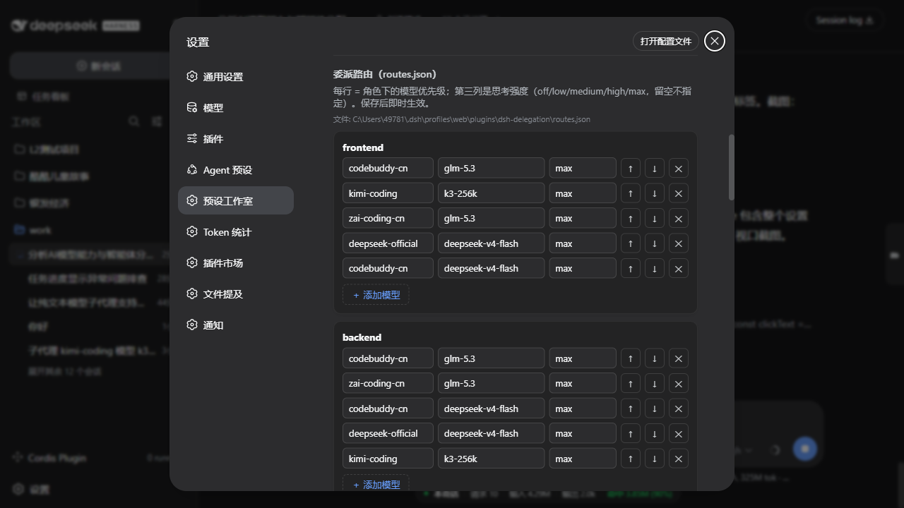
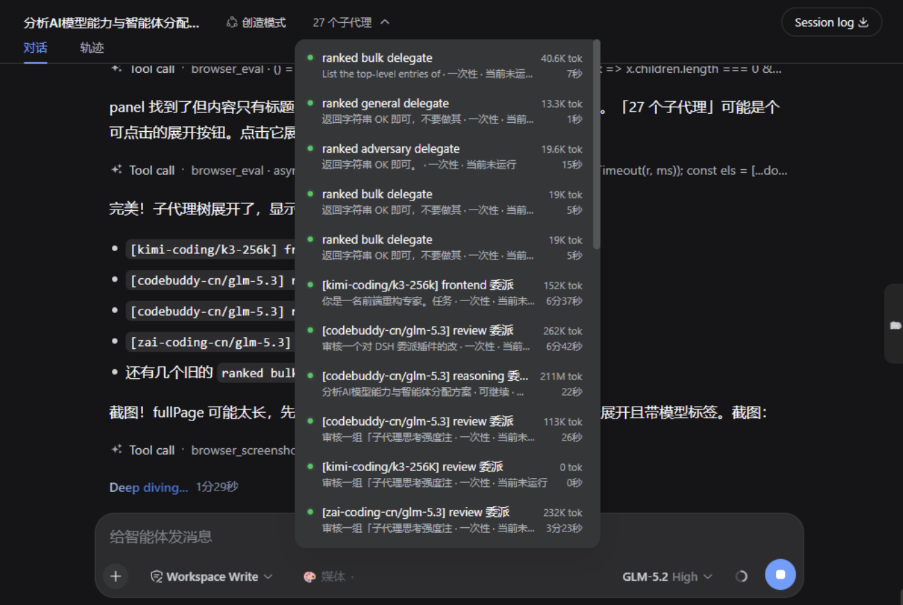

# dsh-delegation-suite

**DeepSeek Harness 智能委派套件**：按任务角色给子代理分配最强模型、失败自动互备切换、每个子代理可独立设置思考强度、名字里直接看到用的什么模型——全部可视化配置，不用改文件。

## 能力一览

| 能力 | 说明 |
|---|---|
| **角色路由 + 失败互备** | `delegate_ranked` 工具按任务类型从路由表选最强模型；遇到欠费、限流、鉴权失败、传输错误、跑崩，自动换下一个模型继续，并返回完整尝试日志 |
| **fork 委派** | `fork: true` 让子代理继承当前对话上下文（追问分析、基于本线程的 review），同时仍然按角色路由模型——不再绑死会话模型 |
| **模型透明** | 每个委派的子代理名字自动带 `[provider/model] 角色 委派` 标签，子代理树里一眼看清谁在用哪个模型（见下图） |
| **行内思考强度** | 路由表每行第三列直接配置思考强度（off/low/medium/high/max，留空不指定）——同一个模型在不同角色可以用不同强度 |
| **可视化编辑** | 设置 → 预设工作室：路由表每行 provider/模型/强度三列输入框，↑↓ 调优先级、✕ 删除、＋添加、保存即生效（无需重启）；还能编辑自定义预设的名称/描述/人格 |
| **委派策略提示** | 内置精简策略段，引导主 agent 在合适时机委派、委派后汇报所用模型 |
| **图片转写（视觉委派）** | 纯文本模型收到图片时，自动派 vision 角色子代理把图片完整转写成文字再继续（走路由表 vision 行 + 失败互备）；在插件设置里可关、可指定专用转写模型、可调超时 |

## 设计特点

- **失败自动换下一个模型**：路由表里列了多个候选，第一个不行（欠费、限流、报错）就自动换第二个，不用你盯着。
  — 就像找装修队：第一个师傅说干不了，马上换下一个，不会傻等。
- **委派的孩子记得前面的对话**：需要接着当前上下文干活的子代理（追问分析、回顾本线程），也能按角色路由到合适的模型。
  — 就像让"老熟人"接手续聊，他记得前面聊到哪，而且还按活儿类型派给最合适的人。
- **路由表可视化编辑**：设置页里一张表格，每行选 provider、模型、强度，上下拖动调优先级，增删改存，保存立即生效。
  — 就像填表格选人干活，不用碰任何配置文件。
- **同一个模型可以分角色定强度**：比如同一个模型干编码用最高强度、干杂活用中等强度。
  — 就像同一个师傅：干精细活时慢慢做，干粗活用点心就行，省力气也省时间。
- **子代理名字带模型标签**：每个委派的子代理直接显示 `[provider/model] 角色 委派`，谁在用什么模型一眼看清。
  — 就像每个干活的小工都挂着名牌：谁在干、用的什么机器，扫一眼就知道。
- **鼓励主 agent 多把活儿分出去**：内置策略提示引导主 agent 优先把独立任务包委派给子代理（而不是自己全干），委派后还自动汇报用了哪个模型。
  — 就像主事的养成习惯：能分给合适小工的活就分下去，自己专心盯大局，干完还有人跟你汇报。
- **安装开箱即用**：纯 JavaScript、无构建步骤，git 安装不用额外构建授权；也提供预打包 tarball。
  — 就像装个软件点"下一步"就行，不用敲命令、不用给额外权限。
- **纯文本模型也能"看"图**：主模型看不了图时，自动派一个能看图的子代理把图片内容转成文字，再接着干活。
  — 就像你眼神不好，身边有个"看图员"把图里的字和内容念给你听。

## 截图

**委派路由编辑器**（设置 → 预设工作室）——每行 = 角色下的模型优先级，第三列是思考强度，保存后即时生效：



**子代理树模型透明**——每个委派的子代理带 `[provider/model] 角色 委派` 标签，状态、token 消耗、耗时一目了然：



## 工具使用指南

### 概述

委派（Delegation）允许主代理将复杂的、可并行的或需要特定专业能力的任务，分派给不同模型和角色的「子代理」执行。子代理根据「角色」和路由配置，自动选择最合适的模型完成工作。

### 基于角色的委派

主代理在 `delegate_ranked` 工具调用中指定一个「角色」，系统按该角色在路由表中定义的模型优先级列表，自动选择最强模型启动子代理；首选模型失败则按列表顺序换下一个。

**角色定义**：

| 角色 | 适用场景 |
|---|---|
| `frontend` | 前端、UI、CSS、TS 开发 |
| `backend` | 后端逻辑、API、基础设施 |
| `reasoning` | 复杂分析、推理、架构设计 |
| `review` | 独立代码审查（与编码者不同模型） |
| `adversary` | 挑刺、红队测试 |
| `vision` | 图像理解 |
| `bulk` | 批量、机械性文件编辑 |
| `analysis` | 大仓库/文档审查 |
| `general` | 通用默认 |

### 路由配置（routes.json）

- **文件位置**：`$DSH_HOME/data/dsh-delegation-suite/routes.json`（首次运行自动生成默认表）
- **格式**：每个角色一个列表，每行 `[provider, model, effort]`（第三列可选：off/low/medium/high/max，留空不指定）；列表顺序 = 模型优先级（从上到下递减）
- **生效**：Web GUI「预设工作室」可视化编辑或直接改 JSON，修改后**即时生效**，无需重启

```json
{
  "frontend": [
    ["kimi-coding", "k3-256k", "max"],
    ["zai-coding-cn", "glm-5.3", "max"],
    ["deepseek-official", "deepseek-v4-flash", "high"]
  ],
  "backend": [
    ["zai-coding-cn", "glm-5.3", "max"],
    ["deepseek-official", "deepseek-v4-flash", "high"]
  ]
}
```

### 子代理执行与监控

子代理面板实时显示所有已启动子代理：状态（运行中/已完成）、`[provider/model] 角色 委派` 标签、token 消耗、耗时、任务摘要。

### 最佳实践

1. **匹配角色**：按任务性质（编码/审查/分析/批量修改）选对角色，确保调用最合适的模型
2. **配置优先级**：把最强最稳的模型放对应角色列表顶部
3. **思考强度分级**：深度推理任务（reasoning）用 `max`；简单机械任务（bulk）用 `off` 或留空提速
4. **监控状态**：用子代理面板盯进度和消耗，及时发现异常（耗时过长/报错）
5. **独立审查**：重要代码改动完成后，用 `review` 角色子代理独立审核（自动用不同模型）

### 多步编排：与 DSH 原生能力配合

本套件负责「选对模型、失败换人、看得清楚」；复杂编排（多步流水线、并行 fan-out 汇总）交给 DSH 原生能力即可：

- **串行多步**（A 产出 → B 依赖 A）：后台委派得到子代理 id 后，用 `send_message` 让它继续下一步，结果在对话里流转。
- **并行聚合**：用 `workflow` 工具声明式编排（pipeline / parallel 阶段），每个阶段里再用 `delegate_ranked` 选模型。
- **状态追踪**：子代理树 + `list_agents` 随时看进度；失败时 `delegate_ranked` 已自动换过模型，无需额外重试逻辑。

## 安装

推荐：预构建 tarball（免 `allowBuilds` 构建授权）：

```powershell
dsh plugin --profile web add https://github.com/wenheguo2/dsh-delegation-suite/releases/download/v1.0.0/dsh-delegation-suite-1.0.0.tgz
```

或从 GitHub 源码安装（本包是纯 JavaScript、无构建步骤，源码安装同样开箱即用）：

```powershell
dsh plugin --profile web add github:wenheguo2/dsh-delegation-suite
```

> **注意**：如果你之前手动在 `profiles/web/cordis.patch.yml` 里添加过 `delegation-ranker` / `policy-hint` / `preset-studio` 行，请先删除这些行再安装本包（同名工具/服务重复注册会冲突）。

### 从源码安装的构建说明

本包是纯 JavaScript（无 TypeScript 构建步骤），`lib/*.js` 即发布产物，因此 **git 安装不需要 `prepare` 脚本、也不触发 pnpm 的 `allowBuilds` 授权**——装完即可用。运行时依赖（`@deepseek-ai/dsh-tools` 等）以 peerDependencies 声明，解析到 harness 自身安装，不会产生独立副本。

## 默认路由表

默认使用 deepseek-official 官方模型（flash / pro），装完在 UI 里改成你自己的 provider 即可。支持任意在「设置 → 模型」里配置过的 provider。

### 图片转写（vision）配置

要让纯文本模型能处理图片，需要在路由表的 **vision 角色**里配置一个**支持图像输入**的模型（如支持多模态的模型/转接服务）。流程：

1. 打开 设置 → 模型，添加一个支持图像的模型（如你的多模态 provider）；
2. 打开 设置 → 预设工作室 → 委派路由，给 `vision` 角色加一行 `[provider, model]`（强度可不填）；
3. 保存路由表。之后纯文本模型收到图片时，会先派 vision 子代理转写图片内容再继续。

插件设置（设置 → 插件 → dsh-delegation）：可关闭转写（`transcribeEnabled`）、指定专用转写模型（`transcribeModel`，指定后不回退到 vision 表）、调整超时（`transcribeTimeoutMs`）。

## 常见问题

**Q：委派报 "all models failed"？**
A：路由表里所有候选都挂了。看返回的尝试日志确认原因（欠费/限流/网络），到设置 → 模型检查对应 provider 的 key 和余额。

**Q：思考强度填错会怎样？**
A：该模型不支持的档位会让请求报 `UNSUPPORTED_REASONING_EFFORT`（响亮报错，不会静默）。改回支持的档位即可。

**Q：会影响我的主会话吗？**
A：不会。强度注入只作用于子代理；主会话的思考强度由 /model 选择器控制。

## 许可

MIT
